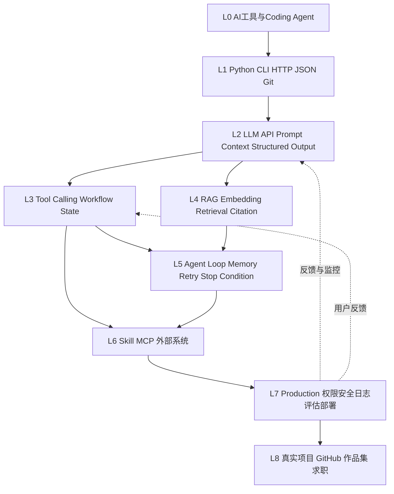

# 普通人 AI 应用工程学习路线

> 一条以真实项目验收为单位的 AI 应用工程路线：从 AI 工具与最低软件工程基础，逐步进入 LLM 应用、Workflow、RAG、Agent、MCP、生产级交付和 GitHub 作品集。

- [飞书知识库原版](https://zcnfzozvzo07.feishu.cn/wiki/WOrswqf3AiKxCfkGXAScw0qgn6e)
- [GitHub 主页入口](https://github.com/Amouren7)
- 同步日期：2026-09-05

以下为总览与学习地图；完整章节正文见 [docs/](./docs/)。

# 普通人 AI 应用工程学习路线`n`n> 🎯 **提示**`n> **这不是“学过 AI”的名词清单，而是一条以真实项目为验收单位的应用工程路线。**目标是：给你一个真实业务问题，你能判断 AI 是否适合、设计方案、做出可运行系统、定位失败、评估效果，并向用户交付。

# 先看这里：你将如何学习

学习主线：问题 → 尝试解决 → 暴露知识缺口 → 学最小必要知识 → 继续项目 → Debug → 重构 → 形成经验。

- 先完成《开始学习前能力诊断》，决定从哪个能力阶段进入。
- 每一阶段都以一个可运行成果和“能够解释、修改、排查、重做”的验收标准结束。
- 允许使用 Codex 或同类 AI Coding Agent，但必须阅读 diff、运行测试、追问设计理由，并自己修改至少一处关键实现。
- 推荐用 8–12 周作为参考节奏；能力验收优先于日历天数，有开发基础可以跳级，零基础可以延长。

# 课程设计方案

受众覆盖非计算机专业学生、弱编程基础学习者、普通软件开发者和希望转向 AI 应用工程的人。路线不以模型训练或算法研究为目标，而以 AI Application Engineer、Agent Engineer、AI Automation Engineer、AI Solutions Engineer、FDE、Solutions Architect 和 AI 产品技术岗位所需的交付能力为目标。

| 设计原则 | 具体做法 |
|-|-|
| 项目驱动 | 知识点必须进入项目；每章都有极简案例、跟做、修改、Debug 挑战、小项目和验收。 |
| 机制先于框架 | 先用原生 API / Python 理解数据流，再用一个主框架完成工程化；框架标注为“生态内容，可替换”。 |
| 理解优先于运行成功 | 学习者要说清数据如何流动、模型何时调用、失败如何处理、为什么选择 Workflow / RAG / Agent。 |
| 真实反馈闭环 | 从测试集、日志、Tracing、成本、延迟和用户反馈判断是否变好，而不是凭感觉。 |
| 少而精的工具栈 | 主线只选必要工具；同类工具最多 1–2 个，避免把产品 UI 当成工程能力。 |

# 能力成长地图

| 阶段 | 核心能力 | 进入条件 | 阶段出口 | 参考时间 |
|-|-|-|-|-|
| L0 | AI 工具与 Coding Agent | 会用 ChatGPT 类工具 | 能拆需求、让 AI 给方案、读 diff、复现问题 | 1–3 天 |
| L1 | 最低软件工程基础 | 能使用电脑和命令行 | Python、CLI、HTTP、JSON、Git、环境变量、异常和日志可独立使用 | 1–2 周 |
| L2 | LLM Application | L1 基础 | 能调用模型，设计 Prompt / Context，处理 Streaming、结构化输出和文件输入 | 1–2 周 |
| L3 | Tool Calling 与 Workflow | L2 | 能设计工具 schema、状态、分支、重试和 Human-in-the-loop，并解释为何不是 Agent | 1–2 周 |
| L4 | RAG 与知识库 | L2；最好已完成 L3 | 能完成文档处理、Chunk、Embedding、检索、Rerank、Citation 和 Evaluation | 1–2 周 |
| L5 | Agent Engineering | L3 + L4 | 能写 Agent Loop，设置 Stop Condition，处理 Memory、Retry，并判断是否滥用 Multi-Agent | 1–2 周 |
| L6 | Skill / MCP / 外部系统 | L3 + L5 | 能区分 Skill、Tool、MCP，并安全接入飞书、GitHub、数据库或 SaaS | 4–7 天 |
| L7 | 生产级工程 | L5 + L6 | 能处理权限、隐私、安全、Guardrail、日志、Tracing、缓存、成本、延迟、部署和回滚 | 1–2 周 |
| L8 | 真实项目与求职 | L7；按专业选题 | 能演示、部署、上传 GitHub、解释架构、呈现取舍和优化证据 | 1–3 周 |

# 能力依赖图

依赖关系不是严格线性课程：L4 可以在 L3 后提前开始，L5 必须同时具备 Workflow 和知识检索的基本理解；L7 的质量、权限和运维要求会反向约束所有早期项目。

# 递进项目体系

| 项目 | 真实问题 | 必须覆盖 | 最终证据 |
|-|-|-|-|
| P1｜基础 AI Application | 论文阅读助手 / 文档分析助手：如何从文件中提取可靠结论？ | LLM API、Prompt、Context、文件输入、Structured Output、JSON Schema、基础 Python、错误处理 | 可运行 Demo；一键复现；至少 3 个失败样例及修复说明 |
| P2｜中型 AI Application | 企业知识库 / 科研知识助手：如何让回答有依据并可追溯？ | 文档处理、Metadata、数据库、Embedding、Chunk、Vector DB、Hybrid Search、Rerank、Query Rewrite、Citation、Workflow、Tool Calling、Eval | 小型测试集、检索对比、引用检查、日志和成本记录 |
| P3｜完整 AI Agent | 按专业背景选择销售、科研、客服、CRM、采购、运营、数据分析或材料科研助手 | 需求分析、架构、LLM、Workflow、Agent、Tool、RAG、Skill、必要时 MCP、数据库、Human-in-the-loop、权限、异常、日志、Eval、部署 | 线上或可复现部署；架构图；决策记录；用户反馈迭代；GitHub README；面试讲解稿 |

**项目统一验收：**能演示；能修改；能独立排查至少一个故障；能不用教程重做核心链路；能比较两种方案；能回答“AI 帮了什么、我决定了什么、系统坏了如何定位、换模型/框架能否重做”。

# 章节导航

| 页面 | 本页解决的问题 | 建议进入时机 |
|-|-|-|
| [00｜开始之前：这套路线适合谁](docs/00-start-here.md) | 判断目标、基础、时间和路线起点 | 第一天 |
| [01｜AI 与 Agent 基础认知](docs/01-ai-and-agent-basics.md) | 从真实问题理解模型、Context、Workflow、RAG、Agent 的边界 | L0 后 |
| [02｜AI 工程最低编程基础](docs/02-engineering-foundations.md) | 补齐 Python、CLI、HTTP、JSON、Git、环境变量、异常和日志 | L0–L1 |
| [03｜构建第一个 LLM 应用](docs/03-first-llm-application.md) | 把模型 API 变成可用的文档分析应用 | L2；P1 |
| [04｜Tool Calling 与 Workflow](docs/04-tool-calling-and-workflow.md) | 让系统稳定执行预先设计的多步任务 | L3 |
| [05｜RAG 与企业知识库](docs/05-rag-and-knowledge-base.md) | 让回答有外部依据、引用和可评估的检索链路 | L4；P2 |
| [06｜Agent Engineering](docs/06-agent-engineering.md) | 实现 Agent Loop、状态、工具、记忆、停止条件和重试 | L5 |
| [07｜Skill / MCP / 外部系统集成](docs/07-skill-mcp-and-integrations.md) | 解决 Agent 连接飞书、GitHub、数据库和 SaaS 的问题 | L6 |
| [08｜生产级 AI 应用工程](docs/08-production-ai-engineering.md) | 把 Demo 变成可观测、可控、可维护、可上线的系统 | L7 |
| [09｜完整项目实战](docs/09-project-practice.md) | 完成 P3：从需求到部署和复盘 | L8 |
| [10｜GitHub 作品集与求职](docs/10-github-portfolio-and-career.md) | 把工程证据转成 README、演示、简历和面试叙事 | P3 后 |
| [11｜AI 应用工程词典](docs/11-ai-application-glossary.md) | 按问题检索术语、机制和边界 | 随用随查 |
| [12｜常见错误与避坑指南](docs/12-common-errors-and-pitfalls.md) | 按故障现象定位 API、数据流、检索、Agent 和部署问题 | 遇错时 |
| [13｜学习进度与打卡](docs/13-learning-progress.md) | 记录阶段、证据、失败和下一步行动 | 每次学习 |
| [14｜AI 导师 Prompt 库](docs/14-ai-mentor-prompts.md) | 用于需求澄清、方案评审、Debug、测试和复盘的提示词 | 全程 |
| [15｜推荐项目与开源项目阅读](docs/15-projects-and-open-source.md) | 用真实仓库学习结构、测试、可观测和工程取舍 | L2 后 |
| [16｜持续更新记录](docs/16-update-log.md) | 记录工具、官方文档和课程内容的更新 | 每次更新 |

# 开始学习前能力诊断

请在 00 页面回答：专业背景；编程基础；Python 水平；Git 水平；是否写过程序；是否调用过 API；是否使用过 AI Coding Agent；是否做过 Workflow 或 Agent；职业目标；希望进入的行业；每天可投入时间；希望完成的项目。

| 诊断结果 | 建议路径 |
|-|-|
| 完全零基础 | L0 → L1 全量 → P1；不要跳过 CLI、HTTP、JSON、Debug 和日志。 |
| 会 Python / 有开发经验 | L0 快速通过，L1 用小测验验收，直接进入 L2 → P1 → P2。 |
| 做过 API / 自动化 | 重点补 L2 的 Context / Structured Output、L3 状态与失败处理，再进入 P2。 |
| 已有 Agent 经验 | 用 P2 的 Evaluation 和 P3 的生产验收反查短板，不默认重复学习框架。 |

# 框架与生态策略

| 层次 | 主线 | 定位 |
|-|-|-|
| 稳定原理 | HTTP / JSON / LLM API / Prompt / Context / Tool / State / Retrieval / Evaluation / Logging / Security | 长期能力，换模型和框架仍然适用 |
| 原生实现 | Python + 一个模型 API；手写最小 Tool Calling、Workflow、Agent Loop 和 RAG | 建立数据流和失败模式的心智模型 |
| 主案例框架 | LangGraph：有状态、可控的 Agent / Workflow 编排；OpenAI Agents SDK：轻量 Agent、工具、交接和护栏案例 | 生态内容，可替换；只在理解原理后使用 |
| 连接标准 | MCP + 飞书开放平台 / GitHub / 数据库中的一个实际连接 | 生态内容；重点学习权限、边界、失败与审计 |
| 低代码对照 | Dify 或 n8n 二选一做快速验证；扣子作为中文生态对照 | 生态内容，可替换；不作为唯一工程能力 |

# 暂时不要学什么

- 目标是 AI 应用工程时，Transformer 数学推导、大模型预训练、CUDA 深度优化和复杂深度学习理论先了解，不投入主线时间。
- 不能因此放弃 Python、Git、HTTP/API、JSON、Debug、日志、数据流和基本数据库；这些是排查和交付的地基。
- 不要为了“全面”同时学习十几个框架；先能不用框架重做核心链路，再比较抽象。

# 质量、证据与更新规则

截至 2026-09-05 完成第一轮官方资料核验。基本原理作为长期内容；工具 UI、模型价格、版本号、排行榜和具体 SDK 接口作为易变内容，每次更新都记录验证日期、官方链接和影响范围。

| 官方资料 | 本路线采用方式 |
|-|-|
| [OpenAI：Responses API](https://platform.openai.com/docs/guides/responses-vs-chat-completions) | 用于 L2 原生 API、结构化输出、工具和流式响应的官方参考；不固化价格或模型排行榜。 |
| [OpenAI Agents SDK](https://openai.github.io/openai-agents-python/) | 用于 L5/L6 的 Agent、工具、交接与护栏案例；标记为可替换生态内容。 |
| [Model Context Protocol](https://modelcontextprotocol.io/introduction) | 用于从“如何连接外部工具和数据”引出 MCP，而不是背诵缩写。 |
| [Anthropic：Claude Code](https://docs.anthropic.com/en/docs/claude-code/overview) | 用于 AI Coding Agent 的工作方式、审查和安全边界对照。 |
| [LangGraph 官方文档](https://docs.langchain.com/oss/python/langgraph/overview) | 用于有状态编排、持久化与可控 Agent 的框架案例。 |
| [Dify 官方文档](https://docs.dify.ai/en/introduction) | 用于低代码应用编排对照，强调抽象与可迁移性。 |
| [n8n 官方文档](https://docs.n8n.io/advanced-ai/) | 用于 AI Workflow 与外部自动化连接对照。 |
| [扣子官方文档](https://www.coze.cn/docs/guides/welcome) | 用于中文低代码 Agent 生态对照，不把当前 UI 当作长期知识。 |
| [飞书开放平台官方文档](https://open.feishu.cn/document/home/index) | 作为企业系统接入与权限边界的实际案例来源。 |

# 总验收标准

- 能够独立解释每个阶段解决的真实问题，而不是只复述术语。
- 能够修改 AI 生成的实现，说明数据流、调用时机、失败处理和方案取舍。
- 能够不用教程重做 P1 的核心链路、P2 的检索链路和 P3 的最小 Agent Loop。
- 能够用测试集、日志、Tracing、延迟、Token / API 成本和用户反馈证明一次优化是否有效。
- 能够判断某个需求应该用普通调用、Workflow、RAG 还是 Agent，并指出 Multi-Agent 何时不值得使用。

# 下一步

00–16 首版正文已完成，当前进入学习者反馈、项目验收和生态更新迭代。后续优先根据真实项目中的失败样例补充案例、测试和迁移说明。
